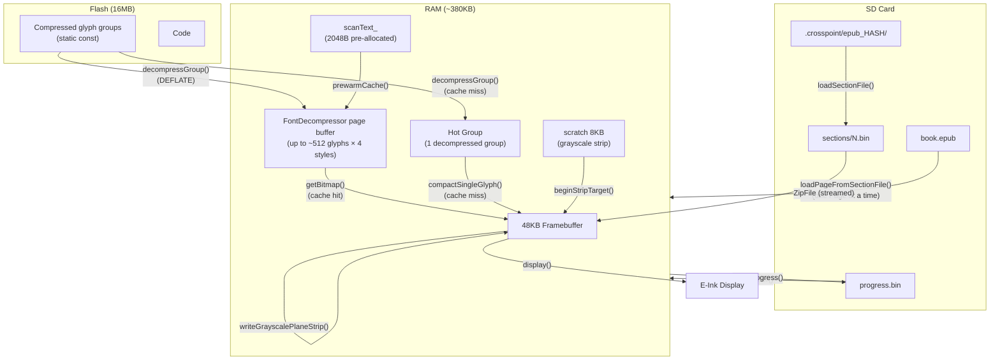

Cache & heap analysis for Reader

Searched for files matching `**/src/activities/reader/**`, 20 matches

Searched for files matching `**/lib/Epub/**`, 20 matches

Searched for files matching `**/lib/EpdFont/**`, 20 matches

Searched for files matching `**/lib/GfxRenderer/**`, 8 matches

Searched for files matching `**/lib/Memory/**`, 1 match

Searched for regex `cache.*clear|clearCache|invalidateCache|cache.*invalid`, 20 results

Searched for regex `SECTION_FILE_VERSION|BOOK_FILE_VERSION|CACHE_VERSION`, 20 results

Read [](file:///Users/still/Documents/dev/crosspoint-mesh/src/activities/reader/EpubReaderActivity.cpp#1-1), lines 1 to 120

Read [](file:///Users/still/Documents/dev/crosspoint-mesh/lib/Epub/Epub/BookMetadataCache.cpp#1-1), lines 1 to 200

Read [](file:///Users/still/Documents/dev/crosspoint-mesh/lib/Epub/Epub/Section.cpp#1-1), lines 1 to 160

Read [](file:///Users/still/Documents/dev/crosspoint-mesh/lib/GfxRenderer/GfxRenderer.cpp#1-1), lines 1 to 100

Read [](file:///Users/still/Documents/dev/crosspoint-mesh/lib/GfxRenderer/FontCacheManager.h)

Read [](file:///Users/still/Documents/dev/crosspoint-mesh/lib/GfxRenderer/FontCacheManager.cpp)

Read [](file:///Users/still/Documents/dev/crosspoint-mesh/src/util/BookCacheUtils.cpp)

Read [](file:///Users/still/Documents/dev/crosspoint-mesh/lib/Memory/Memory.h)

Read [](file:///Users/still/Documents/dev/crosspoint-mesh/src/activities/reader/EpubReaderActivity.cpp#120-120), lines 120 to 350

Read [](file:///Users/still/Documents/dev/crosspoint-mesh/lib/GfxRenderer/GfxRenderer.cpp#400-400), lines 400 to 550

Read [](file:///Users/still/Documents/dev/crosspoint-mesh/lib/Epub/Epub/Section.cpp#160-160), lines 160 to 350

Read [](file:///Users/still/Documents/dev/crosspoint-mesh/lib/Epub/Epub/BookMetadataCache.cpp#200-200), lines 200 to 450

Searched for regex `clearCache|Clear.*Cache|clear.*cache|cache.*clear` (`**/src/activities/reader/**`), 6 results

Read [](file:///Users/still/Documents/dev/crosspoint-mesh/src/activities/reader/ReaderActivity.h)

Read [](file:///Users/still/Documents/dev/crosspoint-mesh/src/activities/reader/EpubReaderActivity.cpp#350-350), lines 350 to 600

Read [](file:///Users/still/Documents/dev/crosspoint-mesh/lib/GfxRenderer/GfxRenderer.cpp#100-100), lines 100 to 250

Searched for regex `storeBwBuffer|restoreBwBuffer|BW_BUFFER|bwBuffer` (`**/lib/GfxRenderer/**`), 20 results

Read [](file:///Users/still/Documents/dev/crosspoint-mesh/lib/Epub/Epub/Section.h)

Read [](file:///Users/still/Documents/dev/crosspoint-mesh/src/activities/reader/EpubReaderActivity.h)

Read [](file:///Users/still/Documents/dev/crosspoint-mesh/lib/GfxRenderer/GfxRenderer.h#1-1), lines 1 to 120

Read [](file:///Users/still/Documents/dev/crosspoint-mesh/lib/GfxRenderer/GfxRenderer.cpp#1580-1580), lines 1580 to 1670

Read [](file:///Users/still/Documents/dev/crosspoint-mesh/src/activities/reader/EpubReaderActivity.cpp#600-600), lines 600 to 900

Read [](file:///Users/still/Documents/dev/crosspoint-mesh/lib/GfxRenderer/GfxRenderer.h#120-120), lines 120 to 256

Searched for regex `Delete.*Cache|deleteCache|clearReadingCache|Clear Reading Cache`, 20 results

Searched for text `RenderLock` (`**/src/activities/reader/**`), 20 results

Read [](file:///Users/still/Documents/dev/crosspoint-mesh/src/activities/reader/EpubReaderActivity.cpp#900-900), lines 900 to 1100

Searched for regex `class RenderLock`, 4 results

Searched for regex `class Epub.*clearCache|Epub::clearCache|void clearCache`, 10 results

Searched for regex `FileFormat|file.format|file-formats|cache format` (`**/docs/**`), 4 results

Searched for files matching `**/lib/EpdFont/FontDecompressor*`, 2 matches

Read [](file:///Users/still/Documents/dev/crosspoint-mesh/src/activities/RenderLock.h)

Read [](file:///Users/still/Documents/dev/crosspoint-mesh/docs/file-formats.md#1-1), lines 1 to 200

Read [](file:///Users/still/Documents/dev/crosspoint-mesh/src/activities/settings/ClearCacheActivity.cpp#1-1), lines 1 to 130

Read [](file:///Users/still/Documents/dev/crosspoint-mesh/lib/Epub/Epub.cpp#495-495), lines 495 to 540

Read [](file:///Users/still/Documents/dev/crosspoint-mesh/lib/EpdFont/SdCardFont.h#1-1), lines 1 to 120

Read [](file:///Users/still/Documents/dev/crosspoint-mesh/docs/file-formats.md#200-200), lines 200 to 400

Read [](file:///Users/still/Documents/dev/crosspoint-mesh/src/activities/reader/EpubReaderActivity.cpp#1100-1100), lines 1100 to 1250

Read [](file:///Users/still/Documents/dev/crosspoint-mesh/lib/EpdFont/FontDecompressor.h)

Read [](file:///Users/still/Documents/dev/crosspoint-mesh/lib/EpdFont/FontDecompressor.cpp#1-1), lines 1 to 150

Searched for regex `class Epub|Epub::Epub|cachePath|\.crosspoint` (`**/lib/Epub/Epub/Epub.h`), no results

Searched for regex `saveProgress|progress\.bin` (`**/src/activities/reader/EpubReaderUtils*`), 2 results

Searched for files matching `**/lib/Epub/Epub/Epub.h`, no matches

Searched for regex `clearCache|PrewarmScope.*clearCache|clearCache.*{` (`**/src/activities/reader/EpubReaderActivity.cpp`), no results

Searched for files matching `**/lib/Epub/Epub.h`, 1 match

Searched for regex `class Epub` (`**/lib/Epub/**`), 2 results

Read [](file:///Users/still/Documents/dev/crosspoint-mesh/src/activities/reader/EpubReaderUtils.h)

Read [](file:///Users/still/Documents/dev/crosspoint-mesh/lib/Epub/Epub.h)

Read [](file:///Users/still/Library/Application%20Support/Code/User/workspaceStorage/a8a711dd3d1320f4e3efd85cbd5446f8/GitHub.copilot-chat/chat-session-resources/bf14879c-5f40-4405-9724-8816b6bde617/call_00_w8qzZOncUrX07AA1xg0z8518__vscode-1782144057471/content.txt)

Now let me supplement with direct reads of a few key files to fill in details:

Read [](file:///Users/still/Documents/dev/crosspoint-mesh/lib/EpdFont/FontDecompressor.h)

Searched for files matching `**/FontCacheManager*`, 2 matches

Searched for files matching `**/FontDecompressor.cpp`, 1 match

Read [](file:///Users/still/Documents/dev/crosspoint-mesh/lib/GfxRenderer/FontCacheManager.h)

Read [](file:///Users/still/Documents/dev/crosspoint-mesh/lib/GfxRenderer/FontCacheManager.cpp)

Read [](file:///Users/still/Documents/dev/crosspoint-mesh/lib/EpdFont/FontDecompressor.cpp#1-1), lines 1 to 300

Read [](file:///Users/still/Documents/dev/crosspoint-mesh/lib/EpdFont/FontDecompressor.cpp#300-300), lines 300 to 400

Read [](file:///Users/still/Documents/dev/crosspoint-mesh/lib/GfxRenderer/GfxRenderer.cpp#1600-1600), lines 1600 to 1707

Searched for text `isScanning` (`**/lib/GfxRenderer/GfxRenderer.cpp`), 4 results

Searched for text `recordText` (`**/lib/GfxRenderer/GfxRenderer.cpp`), 1 result

Read [](file:///Users/still/Documents/dev/crosspoint-mesh/lib/GfxRenderer/GfxRenderer.cpp#395-395), lines 395 to 430

Now I have the full picture. Here is the detailed analysis.

---

# Caching, Heap Management, and Rendering Analysis in Reader Activity

## 1. Overall Caching Architecture

### 1.1 SD Cache for Parsed EPUBs (`.crosspoint/`)

The cache resides on the SD card at `/.crosspoint/epub_<hash>/`. The hash is computed from the book's file path:

```cpp
// lib/Epub/Epub/Epub.h:52-54
explicit Epub(std::string filepath, const std::string& cacheDir)
    : filepath(std::move(filepath)) {
    cachePath = cacheDir + "/epub_"
        + std::to_string(std::hash<std::string>{}(this->filepath));
}
```

**Single-book cache structure:**

| File | Purpose | Format Version |
|---|---|---|
| `book.bin` | Metadata (title, author, TOC) | `BOOK_CACHE_VERSION = 7` |
| `progress.bin` | Reading position (6 bytes: spineIdx + pageNum + pageCount) | Versionless |
| `cover.bmp` | Book cover thumbnail | — |
| `sections/<spineIdx>.bin` | **Pre-laid-out pages** for a chapter | `SECTION_FILE_VERSION = 26` |
| `css_cache.bin` | Parsed CSS cache | `CSS_CACHE_VERSION = 6` |

### 1.2 Section Cache Invalidation (most frequent)

`Section::loadSectionFile()` (`lib/Epub/Epub/Section.cpp:88-124`) reads the binary header and **compares every layout-affecting parameter**:

```cpp
if (fontId != fileFontId ||
    lineCompression != fileLineCompression ||
    extraParagraphSpacing != fileExtraParagraphSpacing ||
    paragraphAlignment != fileParagraphAlignment ||
    viewportWidth != fileViewportWidth ||
    viewportHeight != fileViewportHeight ||
    hyphenationEnabled != fileHyphenationEnabled ||
    embeddedStyle != fileEmbeddedStyle ||
    imageRendering != fileImageRendering ||
    focusReadingEnabled != fileFocusReadingEnabled) {
    file.close();
    clearCache();   // removes section file from SD
    return false;   // → createSectionFile() rebuilds
}
```

**The cache is invalidated on any change to:** font family/size, line spacing, screen orientation, margins, hyphenation, embedded CSS, image rendering mode, focus reading mode, etc. Invalidation is **automatic** — on the next chapter open, parameter mismatch → old cache deleted → new layout generated.

### 1.3 Cache Clearing — User Scenarios

**Three ways:**

1. **Settings → Clear Reading Cache** (`ClearCacheActivity.cpp`): iteratively deletes ALL `epub_*`, `txt_*`, `xtc_*` directories from `.crosspoint/`. Three states: warning → clearing → result.

2. **Reader Menu → Delete Book Cache** (`EpubReaderActivity.cpp:554-567`):
   ```cpp
   case DELETE_CACHE: {
       RenderLock lock(*this);
       section.reset();
       epub->clearCache();      // removes entire .crosspoint/epub_<hash>/
       epub->setupCacheDir();   // re-creates empty cache directory
       saveProgress(...);
   }
   ```
   Then navigates to the home screen. Next book open triggers a full re-parse.

3. **Manual deletion** of `.crosspoint/` from the SD card (from USER_GUIDE.md).

### 1.4 Automatic Recovery from Corruption

- **Corrupt section file**: `loadSectionFile()` detects version/parameter mismatch → `clearCache()` → rebuild.
- **Page load failure** (`EpubReaderActivity.cpp:875-878`):
  ```cpp
  if (!p) {
      section->clearCache();   // delete corrupt file
      section.reset();
      requestUpdate();          // retry
  }
  ```
- **Corrupt book.bin**: `BookMetadataCache::load()` detects version mismatch → returns `false` → full metadata rebuild.

---

## 2. Page Rendering Pipeline and Heap Management

### 2.1 `renderContents()` Flow (line 1002+)

Page rendering is **three-phase**:

```
┌─────────────────────────────────────────────────────┐
│ PHASE 1: FONT PREWARM SCAN                          │
│ ┌─────────────────────────────────────────────────┐ │
│ │ PrewarmScope ctor:                              │ │
│ │  • fontCacheManager.clearCache() — flush caches │ │
│ │  • scanText_.reserve(2048) — pre-allocate       │ │
│ │  • scanMode_ = Scanning                         │ │
│ │                                                 │ │
│ │ page->render() → drawText() in scan mode        │ │
│ │  • Does NOT draw pixels                         │ │
│ │  • Only accumulates text into scanText_         │ │
│ │                                                 │ │
│ │ endScanAndPrewarm():                            │ │
│ │  • prewarmCache() → decompress glyphs into RAM  │ │
│ │  • scanText_.clear() + shrink_to_fit() — cleanup│ │
│ └─────────────────────────────────────────────────┘ │
├─────────────────────────────────────────────────────┤
│ PHASE 2: BW RENDER                                  │
│ ┌─────────────────────────────────────────────────┐ │
│ │ page->render() → drawText() renders glyphs      │ │
│ │  • Reads bitmaps from prewarmed page buffer     │ │
│ │    of FontDecompressor                          │ │
│ │  • Writes into the single 48KB framebuffer      │ │
│ │ renderStatusBar()                               │ │
│ └─────────────────────────────────────────────────┘ │
├─────────────────────────────────────────────────────┤
│ PHASE 3: GRAYSCALE ANTI-ALIASING (if enabled)       │
│ ┌─────────────────────────────────────────────────┐ │
│ │ PATH A (X4, tiled strip) — PRIMARY:             │ │
│ │  • scratch = makeUniqueNoThrow[8KB]             │ │
│ │  • Strip-based rendering, 80 rows per strip     │ │
│ │  • beginStripTarget() → render into scratch     │ │
│ │  • endStripTarget() → send to controller        │ │
│ │  • BW framebuffer is NOT TOUCHED                │ │
│ │                                                 │ │
│ │ PATH B (X3, fallback):                          │ │
│ │  • storeBwBuffer() → 6×8KB malloc = 48KB       │ │
│ │  • Render LSB plane                             │ │
│ │  • Render MSB plane                             │ │
│ │  • restoreBwBuffer() → free all chunks          │ │
│ └─────────────────────────────────────────────────┘ │
└─────────────────────────────────────────────────────┘
```

### 2.2 The Single 48KB Framebuffer Constraint

There is **one** framebuffer (not double-buffered). For grayscale rendering (4 shades), it must be temporarily overwritten. Two approaches:

**Path A — Tiled Strip (X4, preferred):**
```cpp
constexpr int STRIP_ROWS = 80;
auto scratch = makeUniqueNoThrow<uint8_t[]>(gwBytes * STRIP_ROWS); // ~8KB
for (int y = 0; y < gh; y += STRIP_ROWS) {
    renderer.beginStripTarget(scratch.get(), y, rows);
    renderer.clearScreen(0x00);
    page->render(renderer, ...);  // renders into scratch, NOT the framebuffer
    renderer.endStripTarget();
    renderer.writeGrayscalePlaneStrip(true, scratch.get(), y, rows);
}
// BW framebuffer remains untouched!
```
Pros: no need to save 48KB. Cons: re-renders the entire page for each strip.

**Path B — storeBwBuffer (X3, fallback):**
```cpp
// GfxRenderer.cpp:1609-1630 — chunked backup
static constexpr size_t BW_BUFFER_CHUNK_SIZE = 8000; // 8KB chunks
bool GfxRenderer::storeBwBuffer() {
    for (size_t i = 0; i < bwBufferChunks.size(); i++) {
        bwBufferChunks[i] = static_cast<uint8_t*>(malloc(chunkSize));
        memcpy(bwBufferChunks[i], frameBuffer + offset, chunkSize);
    }
}
```
48KB is saved in **6 chunks of 8KB each** — specifically to avoid requiring 48KB of contiguous memory (a fragmented heap may not provide it).

`restoreBwBuffer()` copies the data back and `free()`s all chunks.

### 2.3 onEnter / onExit — Lifecycle Management

**`onEnter()`** (`EpubReaderActivity.cpp:120-156`):
- **Does NOT allocate heap**. Only reads `progress.bin` (6 bytes on stack), configures orientation, creates cache directory on SD.
- All heavy allocations happen **lazily** in `render()` when a section needs loading.

**`onExit()`** (`EpubReaderActivity.cpp:160-173`):
```cpp
section.reset();           // Destroys Section (closes HalFile)
if (pendingReadFolderMove && epub) {
    epub.reset();          // Destroys Epub + BookMetadataCache + CssParser
    // Rename book + cache to /Read/
} else {
    epub.reset();
}
```
`epub.reset()` cascades deallocation: `BookMetadataCache`, `CssParser`, all strings.

### 2.4 Explicit Heap Release on KOReader Sync

The most aggressive heap management example (`EpubReaderActivity.cpp:603-617`):
```cpp
LOG_DBG("KOSync", "Releasing epub for sync (heap before: %u)", ESP.getFreeHeap());
{
    RenderLock lock(*this);
    section.reset();
    epub.reset();
}
LOG_DBG("KOSync", "Epub released (heap after: %u)", ESP.getFreeHeap());
// ... TLS handshake ...
// Then epub is reloaded after sync
```
**The entire Epub + Section are freed** to reclaim ~65KB for the TLS handshake. After sync — reload.

---

## 3. Font Caching — Key Mechanism

### 3.1 Two Font Types, Two Cache Paths

| | Built-in (flash) | SD Card (.cpfont) |
|---|---|---|
| **Storage location** | `static const` in flash | SD card |
| **Storage format** | Compressed glyph groups (DEFLATE) | Pre-decompressed |
| **Cache manager** | `FontDecompressor` | `SdCardFont` |
| **Page buffer** | Up to 512 glyphs × 4 styles | Up to 512 glyphs × 4 styles |
| **Hot group** | Last decompressed group | Not needed |
| **Persistent cache** | — | Advance-width table (advance-only) |

### 3.2 FontDecompressor — Built-in Fonts

**Page buffer** (`FontDecompressor.h:12-13`):
```cpp
static constexpr uint16_t MAX_PAGE_GLYPHS = 512;
static constexpr uint8_t MAX_PAGE_SLOTS = 4;  // Regular/Bold/Italic/BoldItalic
```

**Cache hit**: `getBitmap()` performs binary search in the page buffer → O(log n), returns pointer to already decompressed bitmap.

**Cache miss**: glyph not in page buffer → `getBitmap()` falls back to hot group:
1. If the needed group is already decompressed in `hotGroup` → `compactSingleGlyph()` extracts a single glyph from byte-aligned data into `hotGlyphBuf`.
2. If a different group → `decompressGroup()` (DEFLATE from flash) → stores in `hotGroup` (std::vector).

**`prewarmCache()`** — page-level prewarm optimization:
1. Scans UTF-8 text → collects unique glyph indices (up to 512).
2. Groups by font group (up to 128 groups).
3. `malloc(totalBytes)` — contiguous buffer for ALL needed glyphs.
4. `malloc(glyphCount × sizeof(PageGlyphEntry))` — lookup table.
5. For each group: `decompressGroup()` into temp buffer → copies needed glyphs into page buffer.
6. Temp buffer is freed.

**`clearCache()`**: `free()` page buffer + `free()` glyph table + hot group cleanup (`std::vector::clear()` + `shrink_to_fit()`).

### 3.3 Two-Pass PrewarmScope — Key Optimization

`FontCacheManager::PrewarmScope` (`GfxRenderer/FontCacheManager.cpp:91-128`):

```cpp
// CONSTRUCTOR
scanMode_ = ScanMode::Scanning;
clearCache();                     // Flush ALL font caches
scanText_.reserve(2048);          // Pre-allocate (avoids fragmentation)

// DURING SCAN — drawText() in GfxRenderer.cpp:405-408
if (fontCacheManager_ && fontCacheManager_->isScanning()) {
    fontCacheManager_->recordText(renderedText, fontId, style);
    return;  // DOES NOT DRAW PIXELS!
}

// recordText() just appends text to scanText_ (std::string)
// and counts codepoints per style

// endScanAndPrewarm()
prewarmCache(scanFontId_, scanText_.c_str(), styleMask);
scanText_.clear();
scanText_.shrink_to_fit();        // Return memory to the system
```

**Why two passes?** The first pass (scan) collects ALL text that will be rendered on the page. This allows a **single call** to `prewarmCache()` to decompress all needed glyph groups. Without this, each `drawText()` would call `getBitmap()` and constant cache misses would lead to repeated decompression of the same groups.

### 3.4 Font Change — Full Rebuild

On font family/size change:
1. `section.reset()` — destroys the Section.
2. Next `render()` → `loadSectionFile()` → `fontId` mismatch → `clearCache()` → `createSectionFile()` — **full chapter re-layout**.
3. `PrewarmScope` re-warms the new font's glyphs.

---

## 4. Heap Discipline — Summary

### What is done for memory control:

| Pattern | Where | Why |
|---|---|---|
| `reserve(N)` before `push_back` | `scanText_.reserve(2048)` | Avoids fragmentation from repeated reallocation |
| `makeUniqueNoThrow` instead of `new` | grayscale scratch, section buffer | RAII + returns nullptr on OOM instead of abort() |
| Chunked 48KB allocation | `storeBwBuffer()`: 6×8KB malloc | Avoids requiring 48KB of contiguous memory |
| `std::deque` instead of `std::vector` | `BookMetadataCache` for spine data | Small allocations instead of one large contiguous block |
| Streamed SD writing | `createSectionFile()` | Pages serialized to SD one by one, never held in RAM |
| Page-by-page loading from SD | `loadPageFromSectionFile()` | One `Page` in memory at a time |
| Explicit release before TLS | KOReader sync: `epub.reset()` | Frees ~65KB for the network operation |
| `shrink_to_fit()` | After prewarm, after hot group cleanup | Returns unused vector capacity to the system |
| No long-lived allocations | PrewarmScope, scratch, hotGroup | All freed within a single render cycle |

### What is NOT done:

- **No explicit heap defragmentation** (on ESP32-C3 with newlib there is no standard mechanism).
- **No custom allocator** — uses standard `malloc`/`free` from newlib.
- **No garbage collection** — only RAII and explicit `free`.

---

## 5. Data Flow Diagram



---

**Summary**: The system is built around the principle of "keep minimum in RAM, stream the rest from/to SD." Fonts are cached in layers: two-pass prewarm → page buffer (fast path) → hot group (fallback path) → decompression from flash (slow path). The SD layout cache dramatically speeds up re-opening a book, but is fully invalidated on any display parameter change. Heap is managed through RAII, pre-allocation, and explicit release before costly operations — without defragmentation or custom allocators.